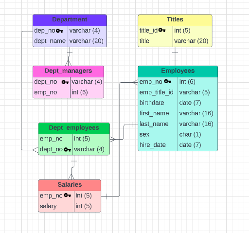
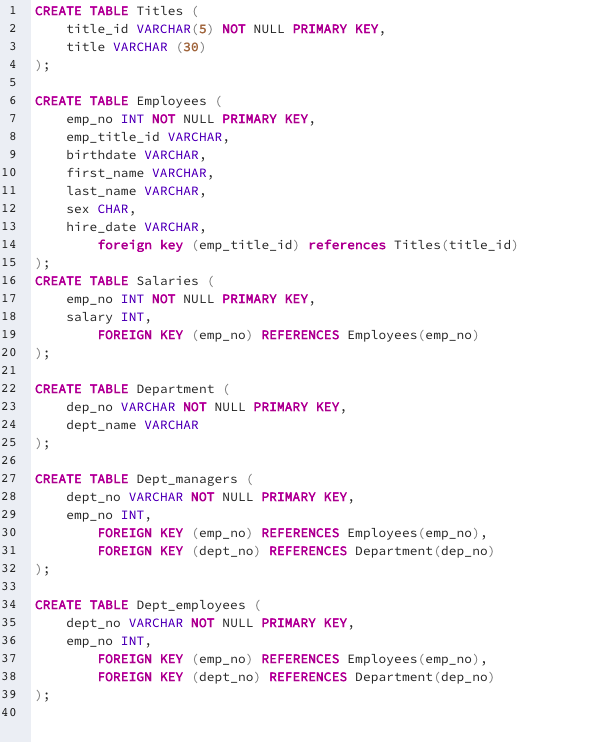

# Organizing_employee_data_using_SQL

### 1. In this project, I started by usingn Lucid Chart to create an ERD. 

### 2. I then used SQL to analyze a companies employees during the 1980's and 1990's using data from 6 CSV files. 

### 3. More specifically, I designed a SQL database and created six tables to correspond with the six different CSV files. 

### 4. I then completed queries to answer key HR questions. 

### 5. I then finished this project by running multiple queries to generate the reports.

## Data Modeling




## Data Engineering



``
CREATE TABLE titles(
	title_id VARCHAR(5) NOT NULL PRIMARY KEY, 
	title VARCHAR (30)
);

CREATE TABLE employees(
	emp_no INT NOT NULL PRIMARY KEY,
	emp_title VARCHAR (5),
	birth_date VARCHAR (10),
	first_name VARCHAR (30),
	last_name VARCHAR (30),
	sex VARCHAR (1),
	hire_date VARCHAR (10),
	FOREIGN KEY (emp_title) REFERENCES titles(title_id)
);

CREATE TABLE salaries(
	emp_no INT NOT NULL PRIMARY KEY,
	salary INT,
	FOREIGN KEY (emp_no) REFERENCES employees(emp_no)
);

CREATE TABLE departments(
	dept_no VARCHAR(4) NOT NULL PRIMARY KEY, 
	dept_name VARCHAR (20)
);

CREATE TABLE dept_manager(
	dept_no VARCHAR(4) NOT NULL,
	emp_no INT NOT NULL,
	PRIMARY KEY (dept_no, emp_no),
	FOREIGN KEY (emp_no) REFERENCES employees(emp_no),
	FOREIGN KEY (dept_no) REFERENCES departments(dept_no)
);

CREATE TABLE dept_emp(
	emp_no INT NOT NULL,
	dept_no VARCHAR(4) NOT NULL, 
	PRIMARY KEY (emp_no, dept_no),
	FOREIGN KEY (emp_no) REFERENCES employees(emp_no),
	FOREIGN KEY (dept_no) REFERENCES departments(dept_no)
);
```

## Data Analysis
  
<li><a href = "Query Results/Query 1_data-1676224140167.csv"> Complete Employee Listing (employee number, last & first name, sex, salary) </a></li>
<li><a href = "Query Results/Query 2_data-1676227624276.csv"> Employees Hired in 1986 (first & last name, hire date) </a></li>
<li><a href = "Query Results/Query 3_data-1676229890024.csv"> Department Managers (dept number, dept name, employee number, last & first name) </a></li>
<li><a href = "Query Results/Query 4_data-1676231835786.csv"> Employees’ Department Numbers (employee number, last & first name, dept name) </a></li>
<li><a href = "Query Results/Query 5_data-1676232646666.csv"> First Name 'Hercules' & Last Name 'B' Listing (first & last name, sex) </a></li>
<li><a href = "Query Results/Query 6_data-1676232994548.csv"> Sales Department Employees (employee number, last & first name) </a></li>
<li><a href = "Query Results/Query 7_data-1676233191647.csv"> Sales and Development Enployees (employee number, last & first name, dept name) </a></li>
<li><a href = "Query Results/Query 8_data-1676234311246.csv"> List of Last Names (frequency counts in descending order) </a></li>

